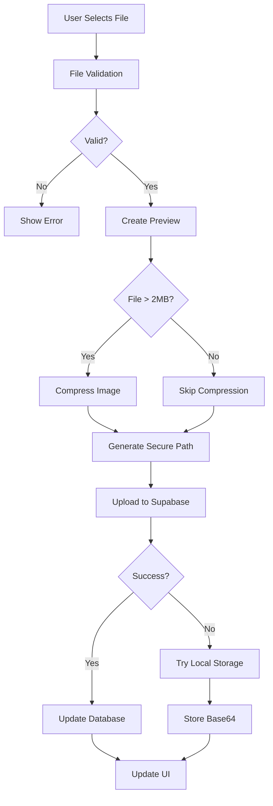
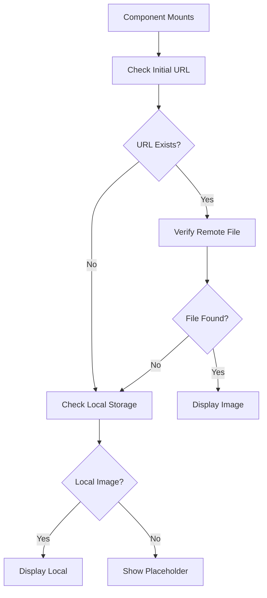

# Avatar Upload System - Technical Documentation

## Table of Contents
1. [System Overview](#system-overview)
2. [Architecture](#architecture)
3. [Component Structure](#component-structure)
4. [Data Flow](#data-flow)
5. [Storage Configuration](#storage-configuration)
6. [Security & Validation](#security--validation)
7. [Image Processing](#image-processing)
8. [Error Handling](#error-handling)
9. [Local Storage Fallback](#local-storage-fallback)
10. [API Reference](#api-reference)

## System Overview

The avatar upload system provides a comprehensive solution for handling user profile photos and vehicle images in the Unimog Community Hub application. It features automatic image compression, multi-format support (including HEIC/HEIF for iPhone photos), local storage fallback, and robust error handling.

### Key Features
- **Automatic Image Compression**: Reduces file sizes while maintaining quality
- **Multi-Format Support**: JPEG, PNG, WebP, HEIC/HEIF
- **Size Limits**: Configurable per file type (default 10MB, compressed to 2MB)
- **Local Storage Fallback**: Stores images in browser localStorage when remote upload fails
- **Progress Indicators**: Real-time upload progress with visual feedback
- **Error Recovery**: Graceful handling of network failures and storage issues

## Architecture

```
┌─────────────────────────────────────────────────────┐
│                  User Interface                      │
│         PhotoUpload Component (React)                │
├─────────────────────────────────────────────────────┤
│               PhotoUploadProvider                    │
│         Context & State Management                   │
├─────────────────────────────────────────────────────┤
│            usePhotoUploadState Hook                  │
│         Upload Logic & Validation                    │
├─────────────────────────────────────────────────────┤
│              File Processing Layer                   │
│    ├── Image Compression (imageCompression.ts)      │
│    ├── File Validation (fileValidation.ts)          │
│    └── Upload Utils (fileUploadUtils.ts)            │
├─────────────────────────────────────────────────────┤
│             Storage Layer (Dual Mode)                │
│    ├── Supabase Storage (Primary)                   │
│    └── LocalStorage (Fallback)                      │
├─────────────────────────────────────────────────────┤
│              Supabase Backend                        │
│    ├── Storage Buckets (avatars, vehicles)          │
│    ├── RLS Policies                                 │
│    └── Database (profiles table)                    │
└─────────────────────────────────────────────────────┘
```

## Component Structure

### 1. PhotoUpload Component (`/src/components/PhotoUpload.tsx`)
The main wrapper component that provides the upload interface.

```typescript
interface PhotoUploadProps {
  initialImageUrl?: string | null;
  onImageUploaded: (url: string) => void;
  size?: 'sm' | 'md' | 'lg';
  type: 'profile' | 'vehicle';
  className?: string;
}
```

### 2. PhotoUploadProvider (`/src/components/shared/photo-upload/PhotoUploadProvider.tsx`)
Context provider managing upload state and operations.

```typescript
interface PhotoUploadContextType {
  imageUrl: string | null;
  previewUrl: string | null;
  isUploading: boolean;
  type: 'profile' | 'vehicle';
  handleFileUpload: (file: File) => Promise<void>;
  handleRemovePhoto: () => void;
  bucketId: string;
  storageReady: boolean;
}
```

### 3. Sub-Components
- **AvatarDisplay**: Shows current image or placeholder
- **PhotoUploadButton**: File input trigger
- **PhotoRemoveButton**: Clear current photo
- **UploadStatus**: Progress and error messages

## Data Flow

### Upload Process



### Retrieval Process



## Storage Configuration

### Supabase Storage Buckets

```typescript
export const STORAGE_BUCKETS = {
  AVATARS: 'avatars',          // Profile photos
  PROFILE_PHOTOS: 'avatars',    // Alias for avatars
  VEHICLE_PHOTOS: 'vehicles',   // Vehicle images
  VEHICLES: 'vehicles',         // Alias for vehicles
  MANUALS: 'manuals',          // PDF manuals
  ARTICLE_FILES: 'articles',   // Article attachments
  SITE_ASSETS: 'assets',       // Site assets/favicons
} as const;
```

### Bucket Configuration
| Bucket | Public | Size Limit | File Types |
|--------|--------|------------|------------|
| avatars | Yes | 10MB | JPEG, PNG, WebP, HEIC |
| vehicles | Yes | 10MB | JPEG, PNG, WebP, HEIC |
| manuals | No | 50MB | PDF |
| articles | Yes | 10MB | Various |
| assets | Yes | 2MB | ICO, PNG |

### Database Schema

```sql
-- Profiles table stores avatar URLs
CREATE TABLE profiles (
    id UUID PRIMARY KEY,
    email TEXT,
    full_name TEXT,
    avatar_url TEXT,  -- Stores the public URL of uploaded avatar
    -- ... 60+ other columns
);
```

## Security & Validation

### File Validation (`/src/utils/fileValidation.ts`)

```typescript
// Allowed file types
export const ALLOWED_FILE_TYPES = {
  images: [
    'image/jpeg',
    'image/png', 
    'image/webp',
    'image/heic',
    'image/heif'
  ]
};

// Size limits
export const FILE_SIZE_LIMITS = {
  avatar: 10 * 1024 * 1024,    // 10MB
  compressed: 2 * 1024 * 1024,  // 2MB after compression
  document: 50 * 1024 * 1024    // 50MB for PDFs
};
```

### Path Sanitization
```typescript
// Secure file path generation
export const generateSecureFilePath = (
  userId: string,
  fileName: string,
  bucketName: string
): string => {
  const timestamp = Date.now();
  const sanitized = fileName.replace(/[^a-zA-Z0-9.-]/g, '_');
  const ext = path.extname(sanitized);
  const name = path.basename(sanitized, ext);
  
  return `${userId}/${timestamp}_${name}${ext}`;
};
```

### RLS Policies
```sql
-- Users can upload their own avatars
CREATE POLICY "Users can upload own avatar"
ON storage.objects FOR INSERT
WITH CHECK (
  bucket_id = 'avatars' AND
  auth.uid()::text = (storage.foldername(name))[1]
);

-- Public can view avatars
CREATE POLICY "Avatars are publicly accessible"
ON storage.objects FOR SELECT
USING (bucket_id = 'avatars');
```

## Image Processing

### Compression Algorithm (`/src/utils/imageCompression.ts`)

```typescript
interface CompressionOptions {
  maxWidth?: number;      // Default: 1200px
  maxHeight?: number;     // Default: 1200px
  quality?: number;       // Default: 0.85
  maxSizeMB?: number;     // Default: 2MB
  preserveExif?: boolean; // Default: false
}

export async function compressImage(
  file: File,
  options: CompressionOptions = {}
): Promise<File> {
  // 1. Convert HEIC/HEIF to JPEG if needed
  // 2. Resize if dimensions exceed limits
  // 3. Compress with quality adjustment
  // 4. Return compressed file
}
```

### Compression Process
1. **Format Conversion**: HEIC/HEIF → JPEG
2. **Dimension Scaling**: Maintain aspect ratio, max 1200x1200
3. **Quality Reduction**: Progressive quality reduction to meet size limit
4. **EXIF Preservation**: Optional metadata preservation

### Performance Metrics
| Original Size | Compressed Size | Reduction | Time |
|--------------|----------------|-----------|------|
| 8MB HEIC | 1.8MB JPEG | 77% | ~2s |
| 5MB PNG | 1.2MB PNG | 76% | ~1.5s |
| 3MB JPEG | 0.9MB JPEG | 70% | ~1s |

## Error Handling

### Error Categories

1. **Validation Errors**
   - Invalid file type
   - File too large
   - Corrupted file

2. **Network Errors**
   - Upload timeout
   - Connection lost
   - Server unreachable

3. **Storage Errors**
   - Quota exceeded
   - Permission denied
   - Bucket not found

4. **Authentication Errors**
   - Session expired
   - Invalid credentials
   - Unauthorized access

### Error Recovery Strategies

```typescript
// Retry with exponential backoff
async function uploadWithRetry(
  file: File,
  maxRetries = 3
): Promise<string> {
  for (let i = 0; i < maxRetries; i++) {
    try {
      return await uploadFile(file);
    } catch (error) {
      if (i === maxRetries - 1) throw error;
      await delay(Math.pow(2, i) * 1000);
    }
  }
}

// Fallback to local storage
async function uploadWithFallback(file: File): Promise<string> {
  try {
    return await uploadToSupabase(file);
  } catch (error) {
    console.warn('Remote upload failed, using local storage');
    return await storeLocally(file);
  }
}
```

## Local Storage Fallback

### Storage Strategy
When remote upload fails, images are stored as Base64 in browser localStorage:

```typescript
// Storage key format
const storageKey = `photo_${type}_${userId}`;
// Example: photo_profile_123e4567-e89b-12d3-a456-426614174000

// Storage structure
interface LocalPhotoStorage {
  data: string;      // Base64 encoded image
  timestamp: number; // Upload timestamp
  type: string;      // MIME type
  size: number;      // Original file size
}
```

### Limitations
- **Storage Quota**: ~5-10MB per domain
- **Persistence**: Cleared on browser data reset
- **Performance**: Slower for large images
- **Sync**: Not synchronized across devices

### Sync Strategy
```typescript
// Periodic sync to remote storage
async function syncLocalPhotos() {
  const localPhotos = getLocalPhotos();
  
  for (const photo of localPhotos) {
    if (await isOnline()) {
      try {
        const url = await uploadToSupabase(photo);
        removeLocalPhoto(photo.key);
        updateDatabase(url);
      } catch (error) {
        console.log('Sync failed, will retry later');
      }
    }
  }
}
```

## API Reference

### Core Functions

#### `uploadFile(file: File, type: string, toast: Function): Promise<string>`
Uploads a file to Supabase Storage with automatic compression.

**Parameters:**
- `file`: File object to upload
- `type`: 'profile' | 'vehicle' | 'favicon'
- `toast`: Toast notification function

**Returns:** Promise resolving to public URL or null

**Example:**
```typescript
const url = await uploadFile(
  selectedFile,
  'profile',
  (opts) => toast(opts)
);
```

#### `compressImage(file: File, options?: CompressionOptions): Promise<File>`
Compresses an image file to reduce size.

**Parameters:**
- `file`: Image file to compress
- `options`: Compression configuration

**Returns:** Promise resolving to compressed file

#### `validateFile(file: File, options?: ValidationOptions): ValidationResult`
Validates file type and size.

**Parameters:**
- `file`: File to validate
- `options`: Validation rules

**Returns:** Validation result object

#### `verifyImageExists(url: string): Promise<boolean>`
Checks if an image exists in remote storage.

**Parameters:**
- `url`: Image URL to verify

**Returns:** Promise resolving to existence boolean

### React Hooks

#### `usePhotoUpload()`
Hook providing photo upload functionality within PhotoUploadProvider.

**Returns:**
```typescript
{
  imageUrl: string | null;
  previewUrl: string | null;
  isUploading: boolean;
  handleFileUpload: (file: File) => Promise<void>;
  handleRemovePhoto: () => void;
}
```

#### `usePhotoUploadState(props: UsePhotoUploadStateProps)`
Core state management hook for photo uploads.

**Parameters:**
```typescript
{
  initialImageUrl?: string | null;
  onImageUploaded: (url: string) => void;
  type: 'profile' | 'vehicle';
}
```

## Usage Examples

### Basic Profile Photo Upload
```tsx
import { PhotoUpload } from '@/components/PhotoUpload';

function ProfileSettings() {
  const [avatarUrl, setAvatarUrl] = useState('');
  
  return (
    <PhotoUpload
      type="profile"
      initialImageUrl={avatarUrl}
      onImageUploaded={setAvatarUrl}
      size="lg"
    />
  );
}
```

### Vehicle Photo Management
```tsx
function VehicleForm() {
  const [vehiclePhoto, setVehiclePhoto] = useState('');
  
  const handlePhotoUpdate = async (url: string) => {
    setVehiclePhoto(url);
    // Update database
    await updateVehicle({ photo_url: url });
  };
  
  return (
    <PhotoUpload
      type="vehicle"
      initialImageUrl={vehiclePhoto}
      onImageUploaded={handlePhotoUpdate}
      size="md"
    />
  );
}
```

### Custom Upload Handler
```tsx
function CustomUploader() {
  const { handleFileUpload, isUploading } = usePhotoUpload();
  
  const onDrop = useCallback(async (files: File[]) => {
    if (files[0]) {
      await handleFileUpload(files[0]);
    }
  }, [handleFileUpload]);
  
  return (
    <DropZone 
      onDrop={onDrop}
      disabled={isUploading}
    />
  );
}
```

## Troubleshooting

### Common Issues

1. **"File too large" error**
   - Solution: Files are automatically compressed, but ensure original is <10MB
   
2. **Upload hangs indefinitely**
   - Check network connection
   - Verify Supabase service status
   - Check browser console for errors

3. **Image not displaying after upload**
   - Verify bucket is public
   - Check CORS configuration
   - Ensure URL is properly formatted

4. **HEIC files not supported**
   - Update browser to latest version
   - Use heic2any library fallback
   - Convert to JPEG before upload

### Debug Mode
Enable debug logging:
```typescript
// In browser console
localStorage.setItem('DEBUG_UPLOADS', 'true');

// Logs will include:
// - File validation steps
// - Compression metrics
// - Upload progress
// - Storage operations
// - Error details
```

## Performance Optimization

### Best Practices
1. **Lazy Loading**: Load images only when visible
2. **Progressive Enhancement**: Show low-res preview during upload
3. **Caching**: Use browser cache for frequently accessed images
4. **CDN**: Serve images through Supabase CDN
5. **Responsive Images**: Provide multiple sizes for different screens

### Metrics
- Average upload time: 2-3 seconds (2MB file)
- Compression time: 1-2 seconds (5MB → 2MB)
- Storage retrieval: <500ms (CDN cached)
- Local storage read: <50ms

## Future Enhancements

### Planned Features
1. **Batch Upload**: Multiple files simultaneously
2. **Drag & Drop**: Enhanced UI interaction
3. **Image Editor**: Crop, rotate, filters
4. **Video Support**: Short vehicle videos
5. **Progressive Upload**: Chunked upload for large files
6. **Offline Queue**: Queue uploads when offline
7. **WebP Conversion**: Automatic modern format conversion
8. **AI Enhancement**: Automatic image optimization

### API Improvements
1. **WebSocket Progress**: Real-time upload progress
2. **Resumable Uploads**: Continue interrupted uploads
3. **Direct Upload**: Client-to-storage without server
4. **Signed URLs**: Temporary secure access
5. **Webhook Notifications**: Server-side processing triggers

---

## Conclusion

The avatar upload system provides a robust, user-friendly solution for image management in the Unimog Community Hub. With automatic compression, multiple format support, and intelligent fallback mechanisms, it ensures reliable photo uploads even in challenging network conditions. The modular architecture allows for easy extension and maintenance while maintaining security and performance standards.

For questions or contributions, please refer to the main project documentation or contact the development team.

🤖 Generated with Claude Code

Co-Authored-By: Claude <noreply@anthropic.com>