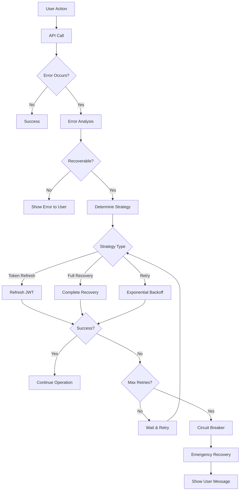
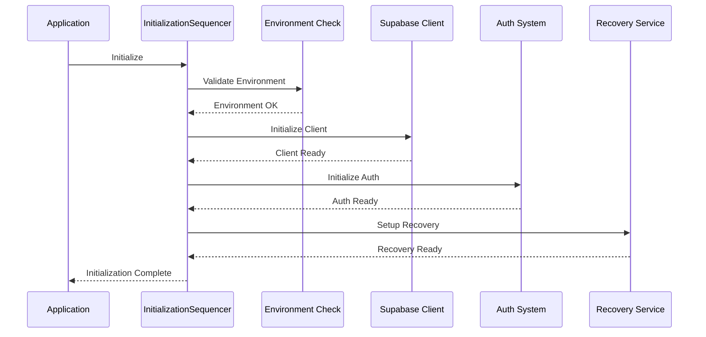

# Comprehensive Automatic Authentication Recovery System

## Overview

This document describes the bulletproof authentication recovery system implemented in the UnimogCommunityHub application. The system automatically handles authentication errors, invalid API keys, network issues, and token expiration without user intervention.

## Architecture Components

### 1. AuthRecoveryService (`src/services/core/AuthRecoveryService.ts`)

The core service that handles all authentication recovery logic with intelligent error handling.

**Key Features:**
- **Circuit Breaker Pattern**: Prevents infinite retry loops by opening the circuit after repeated failures
- **Exponential Backoff**: Implements intelligent retry timing with jitter
- **Environment Validation**: Continuously monitors environment variable configuration
- **Token Cleanup**: Automatically removes stale tokens from localStorage
- **Fallback Mechanisms**: Multiple recovery strategies including storage recovery and periodic retries

**Recovery Strategies:**
```typescript
// Automatic recovery for different error types
await recoveryService.recover(supabaseClient, error);
```

### 2. TokenManager (`src/services/core/TokenManager.ts`)

Advanced token lifecycle management with automatic refresh and fallback mechanisms.

**Key Features:**
- **Proactive Refresh**: Refreshes tokens 5 minutes before expiration
- **Retry Logic**: Exponential backoff with up to 3 retry attempts
- **Fallback Recovery**: Storage recovery and periodic retry attempts
- **Grace Period Handling**: Configurable grace time before expiration
- **Event-Driven Architecture**: Emits events for token lifecycle changes

**Usage:**
```typescript
const tokenManager = new TokenManager(supabaseClient);
tokenManager.setSession(session);
await tokenManager.refreshToken();
```

### 3. Enhanced Supabase Client (`src/lib/supabase-client.ts`)

Wrapper around the standard Supabase client with automatic recovery capabilities.

**Key Features:**
- **Transparent Recovery**: Automatic recovery on auth method calls
- **Initialization Sequencing**: Proper startup order to avoid race conditions
- **Enhanced Error Handling**: Intelligent error categorization and recovery
- **Backward Compatibility**: Drop-in replacement for standard Supabase client

**Enhanced Auth Methods:**
```typescript
// These methods now include automatic recovery
const { data, error } = await supabase.auth.getSession();
const { data, error } = await supabase.auth.refreshSession();
```

### 4. InitializationSequencer (`src/utils/InitializationSequencer.ts`)

Ensures proper initialization order and prevents race conditions.

**Key Features:**
- **Phase-Based Initialization**: Sequential initialization phases
- **Dependency Resolution**: Handles inter-component dependencies
- **Timeout Handling**: Prevents hanging initialization
- **Critical Step Management**: Identifies and handles critical failures

**Initialization Phases:**
1. Environment Check
2. Client Initialization
3. Auth Initialization
4. Recovery Service Setup
5. Service Integration

### 5. Enhanced AuthContext (`src/contexts/AuthContext.tsx`)

React context with comprehensive loading states and recovery integration.

**Key Features:**
- **Granular Loading States**: Separate states for different operations
- **Recovery State Management**: Real-time recovery status updates
- **User-Friendly Actions**: Manual recovery triggers and controls
- **Event Integration**: Seamless integration with recovery services

**Available States:**
```typescript
interface LoadingState {
  initializing: boolean;
  authenticating: boolean;
  refreshing: boolean;
  recovering: boolean;
  signingOut: boolean;
}

interface RecoveryState {
  isRecovering: boolean;
  recoveryAttempts: number;
  recoveryError: string | null;
  circuitBreakerOpen: boolean;
  environmentCheckPassed: boolean;
}
```

### 6. Intelligent Error Handler (`src/utils/supabase-error-handler.ts`)

Advanced error categorization and recovery strategy determination.

**Error Categories:**
- **Authentication**: JWT expiration, invalid credentials, etc.
- **Network**: Connection issues, timeouts, DNS problems
- **Rate Limiting**: Too many requests, throttling
- **Server**: 5xx responses, temporary unavailability
- **Client**: 4xx errors, invalid requests
- **Environment**: Configuration issues, missing variables

**Recovery Strategies:**
- **Immediate Retry**: For transient errors
- **Exponential Backoff**: For network and server issues
- **Token Refresh**: For JWT expiration
- **Full Recovery**: For authentication system issues
- **User Action Required**: For credential problems
- **No Recovery**: For permanent errors

### 7. UI Components (`src/components/auth/AuthRecoveryIndicator.tsx`)

User-friendly components for displaying recovery status and controls.

**Components:**
- **AuthRecoveryIndicator**: Full status dashboard with controls
- **AuthLoadingIndicator**: Minimal inline loading indicator
- **AuthStatusBadge**: Compact status badge

## How It Works Together

### Automatic Error Recovery Flow



### Initialization Sequence



## Usage Examples

### Basic Usage (Automatic)

The system works transparently in the background:

```typescript
// Standard Supabase operations work normally
// Recovery happens automatically on errors
const { data, error } = await supabase.auth.getSession();
const { data, error } = await supabase.from('profiles').select('*');
```

### Manual Recovery Triggers

```typescript
import { useAuth } from '@/contexts/AuthContext';

function MyComponent() {
  const { forceRefresh, triggerRecovery, recoveryState } = useAuth();
  
  // Manual token refresh
  const handleRefresh = () => forceRefresh();
  
  // Manual recovery trigger
  const handleRecovery = () => triggerRecovery();
  
  // Show recovery status
  if (recoveryState.isRecovering) {
    return <div>Recovering connection...</div>;
  }
}
```

### Recovery Status Monitoring

```typescript
import { AuthRecoveryIndicator, AuthStatusBadge } from '@/components/auth/AuthRecoveryIndicator';

function StatusDashboard() {
  return (
    <div>
      {/* Full recovery dashboard */}
      <AuthRecoveryIndicator showDetails showActions />
      
      {/* Minimal status badge */}
      <AuthStatusBadge />
    </div>
  );
}
```

### Error Statistics

```typescript
import { getErrorStatistics, resetErrorCount } from '@/utils/supabase-error-handler';

// Get current error statistics
const stats = getErrorStatistics();
console.log('Current error count:', stats.currentErrorCount);
console.log('Error history:', stats.errorHistory);

// Reset error count if needed
resetErrorCount();
```

## Configuration Options

### Recovery Service Configuration

```typescript
const recoveryService = AuthRecoveryService.getInstance({
  maxRetries: 5,
  backoffMultiplier: 2,
  initialDelay: 1000,
  maxDelay: 30000,
  circuitBreakerThreshold: 10,
  circuitBreakerTimeout: 300000 // 5 minutes
});
```

### Token Manager Configuration

```typescript
const tokenManager = new TokenManager(supabaseClient, {
  maxRetries: 3,
  backoffMultiplier: 2,
  initialDelay: 1000,
  maxDelay: 30000,
  graceTimeSeconds: 300 // 5 minutes before expiry
});
```

### Error Handler Options

```typescript
const result = await handleSupabaseError(error, 'API Call', {
  enableRecovery: true,
  showUserMessages: true,
  maxRetries: 8
});
```

## Environment Variables Required

```bash
# Required for the system to function
VITE_SUPABASE_URL=https://your-project.supabase.co
VITE_SUPABASE_ANON_KEY=eyJhbGciOiJIUzI1NiIs...

# Optional for enhanced features
VITE_MAPBOX_ACCESS_TOKEN=pk.your_mapbox_token
VITE_OPENAI_API_KEY=sk-your_openai_api_key
```

## Benefits

### For Users
- **Seamless Experience**: Authentication issues are resolved automatically
- **No Interruptions**: Background recovery prevents workflow disruptions
- **Clear Feedback**: When manual action is needed, users get clear guidance
- **Reliable Connection**: Robust handling of network and server issues

### For Developers
- **Reduced Support**: Fewer authentication-related support tickets
- **Better Monitoring**: Comprehensive error tracking and statistics
- **Easy Debugging**: Detailed logging and recovery state information
- **Future-Proof**: Extensible architecture for new recovery strategies

### For System Reliability
- **Circuit Breaker**: Prevents cascading failures
- **Rate Limiting**: Respects API limits and prevents abuse
- **Token Management**: Proactive refresh prevents expiration issues
- **Environment Validation**: Catches configuration issues early

## Monitoring and Debugging

### Recovery Events

```typescript
// Listen to recovery events
recoveryService.on('recovery:started', () => console.log('Recovery started'));
recoveryService.on('recovery:success', (data) => console.log('Recovery successful', data));
recoveryService.on('recovery:failed', (error) => console.log('Recovery failed', error));
recoveryService.on('circuit-breaker:opened', () => console.log('Circuit breaker opened'));
```

### Token Events

```typescript
// Listen to token events
tokenManager.on('refresh:started', () => console.log('Token refresh started'));
tokenManager.on('refresh:success', (session) => console.log('Token refreshed', session));
tokenManager.on('fallback:activated', () => console.log('Fallback mechanisms activated'));
```

### Error Statistics

```typescript
// Monitor error patterns
const stats = getErrorStatistics();
if (stats.isInCooldown) {
  console.log(`In cooldown for ${stats.timeUntilCooldownEnd}ms`);
}
```

## Best Practices

1. **Let the System Work**: Trust the automatic recovery - avoid manual interventions
2. **Monitor Events**: Listen to recovery events for debugging and monitoring
3. **User Feedback**: Use the provided UI components for user feedback
4. **Environment Setup**: Ensure all required environment variables are set
5. **Testing**: Test with network issues and invalid configurations
6. **Logging**: Enable appropriate log levels for debugging

## Testing the System

### Simulating Errors

```typescript
// Test network errors
navigator.onLine = false;

// Test JWT expiration
localStorage.setItem('sb-auth-token', 'expired-token');

// Test API key issues
// Temporarily set invalid VITE_SUPABASE_ANON_KEY
```

### Recovery Testing

```typescript
// Test manual recovery
const { triggerRecovery } = useAuth();
await triggerRecovery();

// Test circuit breaker
// Generate multiple errors quickly to trigger circuit breaker
```

This comprehensive authentication recovery system ensures that users have a smooth, uninterrupted experience while providing developers with robust error handling and recovery capabilities.