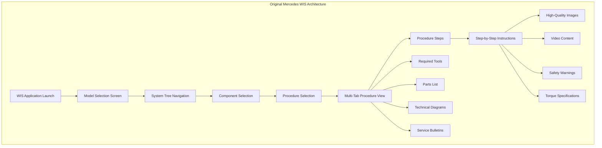
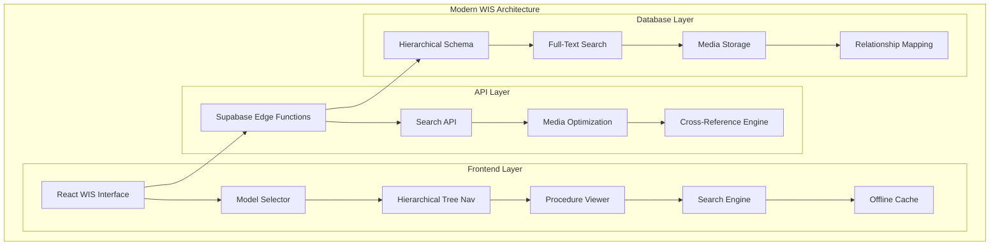

# Mercedes-Benz WIS Reconstruction Project: Complete Treatise

## Executive Summary

This document presents a comprehensive plan to reconstruct the Mercedes-Benz Workshop Information System (WIS) based on extensive analysis of the original system architecture, user workflows, and modern web technologies. Our goal is to transform the current dysfunctional WIS interface into a professional-grade workshop tool that preserves the proven workflows of the original system while leveraging contemporary web capabilities.

## Table of Contents
1. [Project Background & Problem Statement](#project-background--problem-statement)
2. [Original WIS System Analysis](#original-wis-system-analysis)
3. [Current System Assessment](#current-system-assessment)
4. [Comprehensive Solution Architecture](#comprehensive-solution-architecture)
5. [Database Schema Transformation](#database-schema-transformation)
6. [User Interface Design](#user-interface-design)
7. [Implementation Roadmap](#implementation-roadmap)
8. [Technical Specifications](#technical-specifications)
9. [Success Metrics & Testing](#success-metrics--testing)
10. [Risk Assessment & Mitigation](#risk-assessment--mitigation)

---

## Project Background & Problem Statement

### Current Issues
- **Endless Loading**: WIS interface attempts to load entire database, causing system freeze
- **Poor Navigation**: No hierarchical browsing, users lost in flat procedure lists
- **Missing Cross-References**: No automated linking between related procedures, parts, and bulletins
- **Template Data**: Current database contains placeholder/sample data instead of real Mercedes procedures
- **Non-Professional Interface**: Doesn't match workshop standards or mechanic expectations

### Project Objectives
1. **Recreate Original Workflow**: Implement the proven hierarchical navigation system
2. **Professional Presentation**: Match the quality and standards of the original Mercedes WIS
3. **Modern Technology**: Leverage React, TypeScript, and Supabase for reliability and performance
4. **Mobile Optimization**: Tablet-friendly interface for workshop use
5. **Offline Capability**: Essential procedures available without internet connection

---

## Original WIS System Analysis

### System Architecture Overview



### Data Hierarchy Structure

```
Mercedes WIS Data Organization:
├── Vehicle Models (U300, U400, U435, U500, etc.)
│   ├── Systems (01-Engine, 25-Axles, 60-Electrical, etc.)
│   │   ├── Components (10-Assembly, 20-SubAssembly, etc.)
│   │   │   ├── Procedures (01-Remove/Install, 02-Replace, etc.)
│   │   │   │   ├── Steps (1, 2, 3... with media and instructions)
│   │   │   │   ├── Tools (Standard, Special, Safety)
│   │   │   │   ├── Parts (With Mercedes part numbers)
│   │   │   │   └── Cross-References (Related procedures)
│   │   │   └── Service Bulletins (Updates and modifications)
```

### Original User Interface Layout

```
┌─────────────────────────────────────────────────────────────────┐
│ Mercedes-Benz Workshop Information System - U435               │
├─────────────────┬─────────────────────────────┬─────────────────┤
│ Model/Tree Nav  │      Main Content Area      │ Related Content │
│                 │                             │                 │
│ ┌─────────────┐ │ ┌─────────────────────────┐ │ ┌─────────────┐ │
│ │ U435 ▼      │ │ │ Procedure: 25.20.02    │ │ │ Related:    │ │
│ │             │ │ │ Replace Portal Hub Seals│ │ │             │ │
│ │ 01 Engine   │ │ │                         │ │ │ Prerequisites│ │
│ │ 25 Axles ◄  │ │ │ [Proc][Tools][Parts]    │ │ │ • 25.20.01  │ │
│ │  ├25.10 Front│ │ │                         │ │ │             │ │
│ │  ├25.20 Portal│ │ │ Step 3 of 12           │ │ │ Follow-up:  │ │
│ │  │ ├25.20.01  │ │ │                         │ │ │ • 25.20.03  │ │
│ │  │ ├25.20.02 ◄│ │ │ Remove hub cover bolts  │ │ │             │ │
│ │  │ └25.20.03  │ │ │ using 13mm socket...    │ │ │ Bulletins:  │ │
│ │  └25.30 Diff  │ │ │                         │ │ │ • TB-19-001 │ │
│ │ 60 Electrical │ │ │ ┌─────────────────────┐ │ │ └─────────────┘ │
│ │               │ │ │ │  [Technical Image]  │ │ │                 │
│ │ [Search____]  │ │ │ │                     │ │ │                 │
│ └─────────────┘ │ │ └─────────────────────┘ │ │                 │
│                 │ │                         │ │                 │
│                 │ │ ◄ Previous | Next ►     │ │                 │
└─────────────────┴─────────────────────────────┴─────────────────┘
```

### Key Success Factors Identified

1. **Hierarchical Mental Model**: Mechanics think Vehicle → System → Component → Procedure
2. **Visual Learning**: Every step supported by high-quality technical images
3. **Context Preservation**: Always show current location in system tree
4. **Professional Standards**: Clean, uncluttered interface matching technical documentation
5. **Integrated Information**: Tools, parts, and cross-references automatically linked

---

## Current System Assessment

### Existing Database Analysis

**Current Tables Structure:**
```sql
-- Current problematic structure
wis_procedures (850 records, 80 unique titles - massive duplication)
wis_media (10,343 files across multiple buckets)
wis_categories (flat structure, no hierarchy)
```

**Critical Issues Identified:**
1. **Flat Data Structure**: No hierarchical organization by model/system/component
2. **Template Data**: Procedures contain placeholder text instead of real instructions
3. **Massive Duplication**: Same procedure repeated multiple times with different IDs
4. **Missing Relationships**: No cross-referencing between procedures, parts, bulletins
5. **Poor Media Organization**: Images scattered across buckets without clear association

### Current Interface Problems

```typescript
// Current problematic approach
const loadInitialData = async () => {
  // ❌ WRONG: Tries to load entire database
  const procedures = await supabase.from('wis_procedures').select('*');
  // Results in 850 procedures loading simultaneously
};
```

**Root Cause**: Current system treats WIS like a simple database dump rather than a structured workshop tool.

---

## Comprehensive Solution Architecture

### System Architecture Overview



### Component Architecture

```typescript
// New hierarchical component structure
interface WISArchitecture {
  // Top-level container
  WISInterface: {
    modelSelector: WISModelSelector;
    navigationTree: WISNavigationTree;
    procedureViewer: WISProcedureViewer;
    relatedContent: WISRelatedContent;
    searchEngine: WISSearchEngine;
  };

  // Navigation components
  WISNavigationTree: {
    modelNodes: WISModelNode[];
    systemNodes: WISSystemNode[];
    componentNodes: WISComponentNode[];
    procedureNodes: WISProcedureNode[];
  };

  // Procedure viewing
  WISProcedureViewer: {
    procedureHeader: WISProcedureHeader;
    stepNavigator: WISStepNavigator;
    contentTabs: WISContentTabs;
    mediaViewer: WISMediaViewer;
  };
}
```

---

## Database Schema Transformation

### New Hierarchical Schema Design

```sql
-- 1. VEHICLE MODELS TABLE
CREATE TABLE wis_models (
    id UUID PRIMARY KEY DEFAULT gen_random_uuid(),
    model_code VARCHAR(10) NOT NULL UNIQUE, -- 'U435', 'U400'
    model_name VARCHAR(100) NOT NULL,       -- 'Unimog U435'
    description TEXT,
    year_range VARCHAR(20),                 -- '1975-1991'
    image_url TEXT,
    active BOOLEAN DEFAULT true,
    sort_order INTEGER,
    created_at TIMESTAMPTZ DEFAULT NOW()
);

-- 2. SYSTEM CATEGORIES TABLE
CREATE TABLE wis_systems (
    id UUID PRIMARY KEY DEFAULT gen_random_uuid(),
    model_id UUID REFERENCES wis_models(id) ON DELETE CASCADE,
    system_code VARCHAR(10) NOT NULL,       -- '01', '25', '60'
    system_name VARCHAR(100) NOT NULL,      -- 'Engine', 'Axles/Portal Hubs'
    description TEXT,
    icon_name VARCHAR(50),                  -- 'engine', 'gear', 'electric'
    sort_order INTEGER,
    estimated_procedures INTEGER DEFAULT 0,
    created_at TIMESTAMPTZ DEFAULT NOW(),

    UNIQUE(model_id, system_code)
);

-- 3. COMPONENT GROUPS TABLE
CREATE TABLE wis_components (
    id UUID PRIMARY KEY DEFAULT gen_random_uuid(),
    system_id UUID REFERENCES wis_systems(id) ON DELETE CASCADE,
    component_code VARCHAR(10) NOT NULL,    -- '10', '20', '30'
    component_name VARCHAR(100) NOT NULL,   -- 'Portal Hub Assembly'
    description TEXT,
    sort_order INTEGER,
    estimated_procedures INTEGER DEFAULT 0,
    created_at TIMESTAMPTZ DEFAULT NOW(),

    UNIQUE(system_id, component_code)
);

-- 4. PROCEDURES TABLE (Redesigned)
CREATE TABLE wis_procedures (
    id UUID PRIMARY KEY DEFAULT gen_random_uuid(),
    component_id UUID REFERENCES wis_components(id) ON DELETE CASCADE,

    -- Identification
    procedure_code VARCHAR(20) NOT NULL,    -- '25.20.02'
    title VARCHAR(200) NOT NULL,           -- 'Replace Portal Hub Seals'
    description TEXT,

    -- Metadata
    estimated_time_hours DECIMAL(4,2),     -- 2.50
    difficulty_level INTEGER CHECK (difficulty_level BETWEEN 1 AND 5),
    labor_category VARCHAR(50),            -- 'maintenance', 'repair', 'overhaul'

    -- Content
    overview TEXT,                          -- Brief procedure overview
    safety_warnings TEXT[],                 -- Array of safety warnings
    special_notes TEXT[],                   -- Special considerations

    -- Versioning
    version VARCHAR(10) DEFAULT '1.0',
    supersedes_procedure_id UUID REFERENCES wis_procedures(id),
    status VARCHAR(20) DEFAULT 'active',    -- 'active', 'superseded', 'deprecated'

    -- Timestamps
    created_at TIMESTAMPTZ DEFAULT NOW(),
    updated_at TIMESTAMPTZ DEFAULT NOW(),

    -- Search optimization
    search_vector TSVECTOR GENERATED ALWAYS AS (
        to_tsvector('english',
            procedure_code || ' ' ||
            title || ' ' ||
            COALESCE(description, '') || ' ' ||
            COALESCE(overview, '')
        )
    ) STORED,

    UNIQUE(component_id, procedure_code)
);

-- 5. PROCEDURE STEPS TABLE
CREATE TABLE wis_procedure_steps (
    id UUID PRIMARY KEY DEFAULT gen_random_uuid(),
    procedure_id UUID REFERENCES wis_procedures(id) ON DELETE CASCADE,

    -- Step identification
    step_number INTEGER NOT NULL,
    step_title VARCHAR(200),               -- Optional step title

    -- Content
    instruction TEXT NOT NULL,             -- Main instruction text
    detailed_notes TEXT,                   -- Additional technical notes
    safety_warnings TEXT[],                -- Step-specific warnings

    -- Technical specifications
    torque_specs JSONB,                    -- {"M12_bolt": "85 Nm", "M8_bolt": "25 Nm"}
    measurements JSONB,                    -- {"clearance": "0.2mm", "gap": "1.5mm"}

    -- Media references
    primary_image_url TEXT,                -- Main step image
    additional_image_urls TEXT[],          -- Additional images
    video_url TEXT,                        -- Step video if available
    diagram_urls TEXT[],                   -- Technical diagrams

    -- Quality control
    verification_points TEXT[],            -- How to verify step completion
    common_mistakes TEXT[],                -- Known pitfalls

    created_at TIMESTAMPTZ DEFAULT NOW(),

    UNIQUE(procedure_id, step_number)
);

-- 6. PARTS CATALOG TABLE
CREATE TABLE wis_parts (
    id UUID PRIMARY KEY DEFAULT gen_random_uuid(),

    -- Part identification
    mercedes_part_number VARCHAR(50) NOT NULL UNIQUE,
    description VARCHAR(200) NOT NULL,
    category VARCHAR(100),                 -- 'seal', 'gasket', 'bolt', 'fluid'

    -- Specifications
    specifications JSONB,                  -- Technical specs
    supersedes_part_number VARCHAR(50),    -- If part is updated
    superseded_by_part_number VARCHAR(50), -- If part is obsolete

    -- Availability
    status VARCHAR(20) DEFAULT 'available', -- 'available', 'obsolete', 'limited'
    alternative_parts TEXT[],              -- Alternative part numbers

    created_at TIMESTAMPTZ DEFAULT NOW()
);

-- 7. PROCEDURE PARTS RELATIONSHIP
CREATE TABLE wis_procedure_parts (
    id UUID PRIMARY KEY DEFAULT gen_random_uuid(),
    procedure_id UUID REFERENCES wis_procedures(id) ON DELETE CASCADE,
    part_id UUID REFERENCES wis_parts(id),

    -- Usage details
    quantity INTEGER NOT NULL DEFAULT 1,
    usage_note TEXT,                       -- "Per side", "If damaged", etc.
    required BOOLEAN DEFAULT true,         -- true/false for optional parts
    step_numbers INTEGER[],                -- Which steps use this part

    created_at TIMESTAMPTZ DEFAULT NOW(),

    UNIQUE(procedure_id, part_id)
);

-- 8. TOOLS CATALOG TABLE
CREATE TABLE wis_tools (
    id UUID PRIMARY KEY DEFAULT gen_random_uuid(),

    -- Tool identification
    tool_name VARCHAR(200) NOT NULL,
    tool_type VARCHAR(50),                 -- 'standard', 'special', 'safety'
    mercedes_tool_number VARCHAR(50),      -- Official Mercedes tool number

    -- Details
    description TEXT,
    specifications JSONB,                  -- Technical specs
    alternative_tools TEXT[],              -- Alternative tool options

    created_at TIMESTAMPTZ DEFAULT NOW()
);

-- 9. PROCEDURE TOOLS RELATIONSHIP
CREATE TABLE wis_procedure_tools (
    id UUID PRIMARY KEY DEFAULT gen_random_uuid(),
    procedure_id UUID REFERENCES wis_procedures(id) ON DELETE CASCADE,
    tool_id UUID REFERENCES wis_tools(id),

    -- Usage details
    required BOOLEAN DEFAULT true,
    usage_note TEXT,
    step_numbers INTEGER[],                -- Which steps use this tool

    created_at TIMESTAMPTZ DEFAULT NOW(),

    UNIQUE(procedure_id, tool_id)
);

-- 10. PROCEDURE RELATIONSHIPS (Cross-References)
CREATE TABLE wis_procedure_relationships (
    id UUID PRIMARY KEY DEFAULT gen_random_uuid(),
    source_procedure_id UUID REFERENCES wis_procedures(id) ON DELETE CASCADE,
    target_procedure_id UUID REFERENCES wis_procedures(id) ON DELETE CASCADE,

    -- Relationship type
    relationship_type VARCHAR(50) NOT NULL, -- See enum below
    relationship_description TEXT,
    sequence_order INTEGER,                 -- For ordered relationships

    created_at TIMESTAMPTZ DEFAULT NOW(),

    UNIQUE(source_procedure_id, target_procedure_id, relationship_type)
);

-- Relationship types enum
CREATE TYPE procedure_relationship_type AS ENUM (
    'prerequisite',        -- Must be done before
    'follow_up',          -- Should be done after
    'alternative',        -- Alternative approach
    'related',           -- General relationship
    'part_of_series',    -- Part of multi-procedure series
    'references',        -- References for additional info
    'supersedes',        -- This procedure replaces the other
    'see_also'           -- Additional relevant procedures
);

-- 11. SERVICE BULLETINS TABLE
CREATE TABLE wis_service_bulletins (
    id UUID PRIMARY KEY DEFAULT gen_random_uuid(),

    -- Identification
    bulletin_number VARCHAR(50) NOT NULL UNIQUE, -- 'TB-2019-001'
    title VARCHAR(200) NOT NULL,

    -- Content
    description TEXT,
    content TEXT,
    pdf_url TEXT,

    -- Applicability
    applicable_models VARCHAR(20)[], -- ['U435', 'U400']
    applicable_systems VARCHAR(20)[], -- ['25', '01']
    effective_date DATE,

    -- Classification
    severity VARCHAR(20) DEFAULT 'info', -- 'info', 'important', 'critical', 'recall'
    category VARCHAR(50),               -- 'update', 'modification', 'recall', 'notice'

    -- Status
    status VARCHAR(20) DEFAULT 'active', -- 'active', 'superseded', 'withdrawn'
    supersedes_bulletin VARCHAR(50),

    created_at TIMESTAMPTZ DEFAULT NOW(),

    -- Search
    search_vector TSVECTOR GENERATED ALWAYS AS (
        to_tsvector('english',
            bulletin_number || ' ' ||
            title || ' ' ||
            COALESCE(description, '')
        )
    ) STORED
);

-- 12. BULLETIN-PROCEDURE RELATIONSHIPS
CREATE TABLE wis_bulletin_procedures (
    id UUID PRIMARY KEY DEFAULT gen_random_uuid(),
    bulletin_id UUID REFERENCES wis_service_bulletins(id) ON DELETE CASCADE,
    procedure_id UUID REFERENCES wis_procedures(id) ON DELETE CASCADE,

    relationship_type VARCHAR(50) NOT NULL, -- 'updates', 'modifies', 'supersedes', 'affects'
    notes TEXT,

    created_at TIMESTAMPTZ DEFAULT NOW(),

    UNIQUE(bulletin_id, procedure_id)
);

-- 13. USER INTERACTIONS TABLE
CREATE TABLE wis_user_bookmarks (
    id UUID PRIMARY KEY DEFAULT gen_random_uuid(),
    user_id UUID REFERENCES profiles(id) ON DELETE CASCADE,
    procedure_id UUID REFERENCES wis_procedures(id) ON DELETE CASCADE,

    -- User data
    personal_notes TEXT,
    completion_notes TEXT,
    rating INTEGER CHECK (rating BETWEEN 1 AND 5),
    completed_at TIMESTAMPTZ,

    created_at TIMESTAMPTZ DEFAULT NOW(),
    updated_at TIMESTAMPTZ DEFAULT NOW(),

    UNIQUE(user_id, procedure_id)
);

-- INDEXES FOR PERFORMANCE
CREATE INDEX idx_wis_procedures_search ON wis_procedures USING GIN(search_vector);
CREATE INDEX idx_wis_bulletins_search ON wis_service_bulletins USING GIN(search_vector);
CREATE INDEX idx_wis_procedures_component ON wis_procedures(component_id);
CREATE INDEX idx_wis_procedure_steps_procedure ON wis_procedure_steps(procedure_id, step_number);
CREATE INDEX idx_wis_procedure_relationships_source ON wis_procedure_relationships(source_procedure_id);
CREATE INDEX idx_wis_procedure_relationships_target ON wis_procedure_relationships(target_procedure_id);
CREATE INDEX idx_wis_models_active ON wis_models(active, sort_order);
CREATE INDEX idx_wis_systems_model ON wis_systems(model_id, sort_order);
CREATE INDEX idx_wis_components_system ON wis_components(system_id, sort_order);

-- ROW LEVEL SECURITY
ALTER TABLE wis_models ENABLE ROW LEVEL SECURITY;
ALTER TABLE wis_systems ENABLE ROW LEVEL SECURITY;
ALTER TABLE wis_components ENABLE ROW LEVEL SECURITY;
ALTER TABLE wis_procedures ENABLE ROW LEVEL SECURITY;
ALTER TABLE wis_procedure_steps ENABLE ROW LEVEL SECURITY;
ALTER TABLE wis_parts ENABLE ROW LEVEL SECURITY;
ALTER TABLE wis_procedure_parts ENABLE ROW LEVEL SECURITY;
ALTER TABLE wis_tools ENABLE ROW LEVEL SECURITY;
ALTER TABLE wis_procedure_tools ENABLE ROW LEVEL SECURITY;
ALTER TABLE wis_procedure_relationships ENABLE ROW LEVEL SECURITY;
ALTER TABLE wis_service_bulletins ENABLE ROW LEVEL SECURITY;
ALTER TABLE wis_bulletin_procedures ENABLE ROW LEVEL SECURITY;
ALTER TABLE wis_user_bookmarks ENABLE ROW LEVEL SECURITY;

-- Basic read policies (can be refined based on subscription tiers)
CREATE POLICY "WIS content is viewable by authenticated users" ON wis_models FOR SELECT TO authenticated USING (active = true);
CREATE POLICY "WIS systems viewable by authenticated users" ON wis_systems FOR SELECT TO authenticated USING (true);
CREATE POLICY "WIS components viewable by authenticated users" ON wis_components FOR SELECT TO authenticated USING (true);
CREATE POLICY "WIS procedures viewable by authenticated users" ON wis_procedures FOR SELECT TO authenticated USING (status = 'active');
CREATE POLICY "WIS steps viewable by authenticated users" ON wis_procedure_steps FOR SELECT TO authenticated USING (true);
CREATE POLICY "WIS parts viewable by authenticated users" ON wis_parts FOR SELECT TO authenticated USING (true);
CREATE POLICY "WIS procedure parts viewable by authenticated users" ON wis_procedure_parts FOR SELECT TO authenticated USING (true);
CREATE POLICY "WIS tools viewable by authenticated users" ON wis_tools FOR SELECT TO authenticated USING (true);
CREATE POLICY "WIS procedure tools viewable by authenticated users" ON wis_procedure_tools FOR SELECT TO authenticated USING (true);
CREATE POLICY "WIS relationships viewable by authenticated users" ON wis_procedure_relationships FOR SELECT TO authenticated USING (true);
CREATE POLICY "WIS bulletins viewable by authenticated users" ON wis_service_bulletins FOR SELECT TO authenticated USING (status = 'active');
CREATE POLICY "WIS bulletin procedures viewable by authenticated users" ON wis_bulletin_procedures FOR SELECT TO authenticated USING (true);

-- User bookmarks policies
CREATE POLICY "Users can manage their own bookmarks" ON wis_user_bookmarks FOR ALL TO authenticated USING (auth.uid() = user_id);
```

### Data Migration Strategy

```sql
-- MIGRATION PLAN: Transform current flat data into hierarchical structure

-- Step 1: Create sample hierarchical data for U435
INSERT INTO wis_models (model_code, model_name, description, year_range, sort_order) VALUES
('U435', 'Unimog U435', 'Medium duty Unimog with portal axles', '1975-1991', 1);

-- Step 2: Create system categories
WITH model AS (SELECT id FROM wis_models WHERE model_code = 'U435')
INSERT INTO wis_systems (model_id, system_code, system_name, description, sort_order)
SELECT
    model.id,
    system_code,
    system_name,
    description,
    ROW_NUMBER() OVER (ORDER BY system_code::INTEGER)
FROM model, (VALUES
    ('01', 'Engine', 'Engine and related components'),
    ('25', 'Axles/Portal Hubs', 'Front and rear axles, portal hubs, differentials'),
    ('30', 'Suspension', 'Springs, shock absorbers, stabilizers'),
    ('35', 'Steering', 'Steering system and components'),
    ('40', 'Brakes', 'Brake system and components'),
    ('50', 'Body/Cab', 'Body panels, doors, windows, interior'),
    ('60', 'Electrical', 'Electrical system and components')
) AS systems(system_code, system_name, description);

-- Step 3: Create component groups for Axles system
WITH system AS (SELECT id FROM wis_systems s JOIN wis_models m ON s.model_id = m.id WHERE m.model_code = 'U435' AND s.system_code = '25')
INSERT INTO wis_components (system_id, component_code, component_name, description, sort_order)
SELECT
    system.id,
    component_code,
    component_name,
    description,
    ROW_NUMBER() OVER (ORDER BY component_code::INTEGER)
FROM system, (VALUES
    ('10', 'Front Axle Assembly', 'Complete front axle with differential'),
    ('20', 'Portal Hub Assembly', 'Portal hub gears, seals, and housing'),
    ('30', 'Differential', 'Differential gears and carrier'),
    ('40', 'Axle Tubes', 'Axle tubes and mounting points')
) AS components(component_code, component_name, description);

-- Step 4: Create sample procedures for Portal Hub component
WITH component AS (
    SELECT c.id
    FROM wis_components c
    JOIN wis_systems s ON c.system_id = s.id
    JOIN wis_models m ON s.model_id = m.id
    WHERE m.model_code = 'U435' AND s.system_code = '25' AND c.component_code = '20'
)
INSERT INTO wis_procedures (component_id, procedure_code, title, description, estimated_time_hours, difficulty_level, overview, safety_warnings)
SELECT
    component.id,
    procedure_code,
    title,
    description,
    estimated_time_hours,
    difficulty_level,
    overview,
    safety_warnings
FROM component, (VALUES
    ('25.20.01', 'Remove/Install Portal Hub Assembly', 'Complete removal and installation of portal hub', 4.0, 3, 'This procedure covers the complete removal and installation of the portal hub assembly including disconnection of all related components.', ARRAY['Use proper lifting equipment', 'Ensure vehicle is securely supported']),
    ('25.20.02', 'Replace Portal Hub Seals', 'Replace all seals in portal hub assembly', 2.5, 2, 'Replacement of oil seals and dust seals in the portal hub assembly to prevent oil leakage.', ARRAY['Wear safety glasses', 'Use nitrile gloves when handling seals']),
    ('25.20.03', 'Portal Hub Oil Change', 'Change portal hub oil and inspect components', 1.0, 1, 'Regular maintenance procedure to change portal hub oil and inspect internal components.', ARRAY['Dispose of used oil properly', 'Check for metal particles in old oil']),
    ('25.20.04', 'Portal Hub Bearing Replacement', 'Replace portal hub bearings', 3.5, 4, 'Complete bearing replacement including pressing operations and preload adjustment.', ARRAY['Use proper pressing tools only', 'Follow torque specifications exactly'])
) AS procedures(procedure_code, title, description, estimated_time_hours, difficulty_level, overview, safety_warnings);
```

---

## User Interface Design

### Modern WIS Interface Components

#### 1. Model Selection Interface
```typescript
// WISModelSelector Component
const WISModelSelector: React.FC = () => {
  const { data: models, isLoading } = useWISModels();
  const [selectedModel, setSelectedModel] = useWISStore(state => [state.selectedModel, state.setSelectedModel]);

  return (
    <div className="bg-white border-b p-4">
      <div className="flex items-center gap-4">
        
        <Select value={selectedModel} onValueChange={setSelectedModel}>
          <SelectTrigger className="w-48">
            <SelectValue placeholder="Select Vehicle Model" />
          </SelectTrigger>
          <SelectContent>
            {models?.map(model => (
              <SelectItem key={model.id} value={model.id}>
                <div className="flex items-center gap-2">
                  <span className="font-medium">{model.model_code}</span>
                  <span className="text-gray-600">{model.model_name}</span>
                </div>
              </SelectItem>
            ))}
          </SelectContent>
        </Select>
      </div>
    </div>
  );
};
```

#### 2. Hierarchical Navigation Tree
```typescript
// WISNavigationTree Component
interface WISTreeNode {
  id: string;
  type: 'model' | 'system' | 'component' | 'procedure';
  code: string;
  name: string;
  description?: string;
  children?: WISTreeNode[];
  procedureCount?: number;
  estimatedTime?: number;
  icon?: string;
}

const WISNavigationTree: React.FC = () => {
  const [selectedModel] = useWISStore(state => [state.selectedModel]);
  const [expandedNodes, setExpandedNodes] = useState<Set<string>>(new Set());
  const [selectedProcedure, setSelectedProcedure] = useWISStore(state => [state.selectedProcedure, state.setSelectedProcedure]);

  const { data: treeData, isLoading } = useWISTreeData(selectedModel);

  const toggleNode = (nodeId: string) => {
    setExpandedNodes(prev => {
      const newSet = new Set(prev);
      if (newSet.has(nodeId)) {
        newSet.delete(nodeId);
      } else {
        newSet.add(nodeId);
      }
      return newSet;
    });
  };

  const renderTreeNode = (node: WISTreeNode, level: number = 0) => {
    const isExpanded = expandedNodes.has(node.id);
    const hasChildren = node.children && node.children.length > 0;
    const isSelected = node.type === 'procedure' && selectedProcedure === node.id;

    return (
      <div key={node.id}>
        {/* Node Content */}
        <div
          className={cn(
            "flex items-center gap-2 p-2 hover:bg-gray-50 cursor-pointer",
            `ml-${level * 4}`,
            isSelected && "bg-blue-50 border-r-2 border-blue-500"
          )}
          onClick={() => {
            if (node.type === 'procedure') {
              setSelectedProcedure(node.id);
            } else if (hasChildren) {
              toggleNode(node.id);
            }
          }}
        >
          {/* Expand/Collapse Icon */}
          {hasChildren && (
            <Button
              variant="ghost"
              size="sm"
              className="p-0 h-4 w-4"
              onClick={(e) => {
                e.stopPropagation();
                toggleNode(node.id);
              }}
            >
              {isExpanded ? (
                <ChevronDown className="h-3 w-3" />
              ) : (
                <ChevronRight className="h-3 w-3" />
              )}
            </Button>
          )}

          {/* Node Icon */}
          {node.icon && (
            <div className="w-4 h-4">
              {node.type === 'system' && <WISSystemIcon name={node.icon} />}
              {node.type === 'component' && <WISComponentIcon name={node.icon} />}
              {node.type === 'procedure' && <FileText className="h-3 w-3 text-blue-600" />}
            </div>
          )}

          {/* Node Code and Name */}
          <div className="flex items-center gap-2 flex-1 min-w-0">
            <span className="text-sm font-medium text-gray-900">{node.code}</span>
            <span className="text-sm text-gray-600 truncate">{node.name}</span>
          </div>

          {/* Metadata */}
          <div className="flex items-center gap-1 text-xs text-gray-400">
            {node.procedureCount && (
              <span className="bg-gray-100 px-1 rounded">
                {node.procedureCount}
              </span>
            )}
            {node.estimatedTime && (
              <span className="text-blue-600">
                {node.estimatedTime}h
              </span>
            )}
          </div>
        </div>

        {/* Children */}
        {hasChildren && isExpanded && (
          <div>
            {node.children?.map(child => renderTreeNode(child, level + 1))}
          </div>
        )}
      </div>
    );
  };

  if (isLoading) return <WISTreeSkeleton />;

  return (
    <ScrollArea className="flex-1">
      <div className="p-2">
        {treeData?.map(node => renderTreeNode(node))}
      </div>
    </ScrollArea>
  );
};
```

#### 3. Professional Procedure Viewer
```typescript
// WISProcedureViewer Component
const WISProcedureViewer: React.FC = () => {
  const [selectedProcedure] = useWISStore(state => [state.selectedProcedure]);
  const [activeTab, setActiveTab] = useState<'overview' | 'steps' | 'tools' | 'parts' | 'diagrams' | 'bulletins'>('overview');
  const [currentStep, setCurrentStep] = useState(1);

  const { data: procedure, isLoading } = useWISProcedure(selectedProcedure);
  const { data: steps } = useWISProcedureSteps(selectedProcedure);

  if (!selectedProcedure) {
    return <WISWelcomeScreen />;
  }

  if (isLoading) {
    return <WISProcedureViewerSkeleton />;
  }

  return (
    <div className="flex flex-col h-full bg-white">
      {/* Procedure Header */}
      <div className="border-b bg-gray-50 px-6 py-4">
        <div className="flex items-start justify-between">
          <div className="space-y-1">
            <div className="flex items-center gap-2">
              <span className="text-lg font-bold text-blue-600">
                {procedure?.procedure_code}
              </span>
              <Badge variant="outline" className="text-xs">
                v{procedure?.version}
              </Badge>
            </div>
            <h1 className="text-xl font-semibold text-gray-900">
              {procedure?.title}
            </h1>
            {procedure?.description && (
              <p className="text-sm text-gray-600 max-w-2xl">
                {procedure.description}
              </p>
            )}
          </div>

          <div className="flex items-center gap-3">
            <div className="text-right text-sm">
              <div className="text-gray-500">Estimated Time</div>
              <div className="font-semibold">{procedure?.estimated_time_hours}h</div>
            </div>
            <div className="text-right text-sm">
              <div className="text-gray-500">Difficulty</div>
              <div className="flex items-center gap-1">
                {Array.from({ length: 5 }, (_, i) => (
                  <Star
                    key={i}
                    className={cn(
                      "h-3 w-3",
                      i < (procedure?.difficulty_level || 0)
                        ? "fill-yellow-400 text-yellow-400"
                        : "text-gray-300"
                    )}
                  />
                ))}
              </div>
            </div>
            <WISBookmarkButton procedureId={selectedProcedure} />
            <WISPrintButton procedureId={selectedProcedure} />
          </div>
        </div>

        {/* Safety Warnings */}
        {procedure?.safety_warnings && procedure.safety_warnings.length > 0 && (
          <Alert variant="destructive" className="mt-4">
            <AlertTriangle className="h-4 w-4" />
            <AlertTitle>Safety Warnings</AlertTitle>
            <AlertDescription>
              <ul className="list-disc list-inside space-y-1">
                {procedure.safety_warnings.map((warning, index) => (
                  <li key={index} className="text-sm">{warning}</li>
                ))}
              </ul>
            </AlertDescription>
          </Alert>
        )}
      </div>

      {/* Tab Navigation */}
      <Tabs value={activeTab} onValueChange={setActiveTab} className="flex-1 flex flex-col">
        <TabsList className="rounded-none border-b bg-transparent p-0 h-auto">
          <TabsTrigger value="overview" className="rounded-none border-b-2 border-transparent data-[state=active]:border-blue-500">
            Overview
          </TabsTrigger>
          <TabsTrigger value="steps" className="rounded-none border-b-2 border-transparent data-[state=active]:border-blue-500">
            Steps ({steps?.length || 0})
          </TabsTrigger>
          <TabsTrigger value="tools" className="rounded-none border-b-2 border-transparent data-[state=active]:border-blue-500">
            Tools
          </TabsTrigger>
          <TabsTrigger value="parts" className="rounded-none border-b-2 border-transparent data-[state=active]:border-blue-500">
            Parts
          </TabsTrigger>
          <TabsTrigger value="diagrams" className="rounded-none border-b-2 border-transparent data-[state=active]:border-blue-500">
            Diagrams
          </TabsTrigger>
          <TabsTrigger value="bulletins" className="rounded-none border-b-2 border-transparent data-[state=active]:border-blue-500">
            Bulletins
          </TabsTrigger>
        </TabsList>

        <div className="flex-1 overflow-hidden">
          <TabsContent value="overview" className="h-full p-6 m-0">
            <WISProcedureOverview procedure={procedure} />
          </TabsContent>

          <TabsContent value="steps" className="h-full p-0 m-0">
            <WISProcedureSteps
              procedureId={selectedProcedure}
              currentStep={currentStep}
              onStepChange={setCurrentStep}
            />
          </TabsContent>

          <TabsContent value="tools" className="h-full p-6 m-0">
            <WISToolsList procedureId={selectedProcedure} />
          </TabsContent>

          <TabsContent value="parts" className="h-full p-6 m-0">
            <WISPartsList procedureId={selectedProcedure} />
          </TabsContent>

          <TabsContent value="diagrams" className="h-full p-6 m-0">
            <WISDiagramsViewer procedureId={selectedProcedure} />
          </TabsContent>

          <TabsContent value="bulletins" className="h-full p-6 m-0">
            <WISServiceBulletins procedureId={selectedProcedure} />
          </TabsContent>
        </div>
      </Tabs>
    </div>
  );
};
```

#### 4. Advanced Search Interface
```typescript
// WISSearchInterface Component
const WISSearchInterface: React.FC = () => {
  const [searchQuery, setSearchQuery] = useState('');
  const [searchType, setSearchType] = useState<'all' | 'procedures' | 'parts' | 'bulletins'>('all');
  const [isVoiceSearching, setIsVoiceSearching] = useState(false);

  const { data: searchResults, isLoading } = useWISSearch({
    query: searchQuery,
    searchType: searchType,
    enabled: searchQuery.length > 2
  });

  const { startListening, stopListening, transcript } = useVoiceSearch();

  useEffect(() => {
    if (transcript) {
      setSearchQuery(transcript);
    }
  }, [transcript]);

  return (
    <div className="border-b bg-white p-4">
      <div className="space-y-4">
        {/* Search Input */}
        <div className="relative">
          <Search className="absolute left-3 top-1/2 transform -translate-y-1/2 text-gray-400 h-4 w-4" />
          <Input
            type="text"
            placeholder="Search procedures, parts, or bulletins..."
            value={searchQuery}
            onChange={(e) => setSearchQuery(e.target.value)}
            className="pl-10 pr-12"
          />
          <Button
            variant="ghost"
            size="sm"
            className={cn(
              "absolute right-1 top-1/2 transform -translate-y-1/2 h-8 w-8 p-0",
              isVoiceSearching && "text-red-500"
            )}
            onClick={() => {
              if (isVoiceSearching) {
                stopListening();
                setIsVoiceSearching(false);
              } else {
                startListening();
                setIsVoiceSearching(true);
              }
            }}
          >
            <Mic className="h-4 w-4" />
          </Button>
        </div>

        {/* Search Type Filter */}
        <div className="flex gap-2">
          <Button
            variant={searchType === 'all' ? 'default' : 'outline'}
            size="sm"
            onClick={() => setSearchType('all')}
          >
            All Results
          </Button>
          <Button
            variant={searchType === 'procedures' ? 'default' : 'outline'}
            size="sm"
            onClick={() => setSearchType('procedures')}
          >
            Procedures
          </Button>
          <Button
            variant={searchType === 'parts' ? 'default' : 'outline'}
            size="sm"
            onClick={() => setSearchType('parts')}
          >
            Parts
          </Button>
          <Button
            variant={searchType === 'bulletins' ? 'default' : 'outline'}
            size="sm"
            onClick={() => setSearchType('bulletins')}
          >
            Bulletins
          </Button>
        </div>

        {/* Search Results */}
        {searchQuery.length > 2 && (
          <div className="border rounded-lg bg-white shadow-sm max-h-96 overflow-y-auto">
            {isLoading ? (
              <div className="p-4">
                <div className="space-y-2">
                  {Array.from({ length: 3 }, (_, i) => (
                    <Skeleton key={i} className="h-12 w-full" />
                  ))}
                </div>
              </div>
            ) : searchResults && searchResults.length > 0 ? (
              <div className="divide-y">
                {searchResults.map((result, index) => (
                  <WISSearchResult key={index} result={result} />
                ))}
              </div>
            ) : (
              <div className="p-4 text-center text-gray-500">
                No results found for "{searchQuery}"
              </div>
            )}
          </div>
        )}
      </div>
    </div>
  );
};
```

### Visual Design System

#### Color Palette
```css
:root {
  /* Mercedes-Benz Brand Colors */
  --mercedes-blue: #0f1419;
  --mercedes-silver: #c4c4c4;
  --mercedes-light-blue: #00adef;

  /* WIS Specific Colors */
  --wis-primary: #1e40af;        /* Blue 700 */
  --wis-primary-light: #3b82f6;  /* Blue 500 */
  --wis-secondary: #64748b;      /* Slate 500 */
  --wis-success: #059669;        /* Emerald 600 */
  --wis-warning: #d97706;        /* Amber 600 */
  --wis-danger: #dc2626;         /* Red 600 */

  /* Interface Colors */
  --wis-bg-primary: #ffffff;
  --wis-bg-secondary: #f8fafc;   /* Slate 50 */
  --wis-bg-tertiary: #f1f5f9;    /* Slate 100 */

  /* Text Colors */
  --wis-text-primary: #0f172a;   /* Slate 900 */
  --wis-text-secondary: #475569; /* Slate 600 */
  --wis-text-tertiary: #94a3b8;  /* Slate 400 */

  /* Border Colors */
  --wis-border-light: #e2e8f0;   /* Slate 200 */
  --wis-border-medium: #cbd5e1;  /* Slate 300 */
}
```

#### Typography Scale
```css
.wis-typography {
  /* Procedure Codes */
  .procedure-code {
    @apply text-lg font-bold text-blue-600 font-mono;
  }

  /* Procedure Titles */
  .procedure-title {
    @apply text-xl font-semibold text-gray-900;
  }

  /* System Names */
  .system-name {
    @apply text-base font-medium text-gray-900;
  }

  /* Step Instructions */
  .step-instruction {
    @apply text-sm leading-relaxed text-gray-900;
  }

  /* Technical Specifications */
  .tech-spec {
    @apply text-sm font-mono text-gray-700 bg-gray-50 px-2 py-1 rounded;
  }

  /* Safety Warnings */
  .safety-warning {
    @apply text-sm text-red-700 font-medium;
  }
}
```

---

## Implementation Roadmap

### Phase 1: Foundation (Weeks 1-2)
#### Database Migration and Core Infrastructure

**Week 1: Database Schema**
- [ ] Create new hierarchical database schema
- [ ] Set up migration scripts from current flat structure
- [ ] Implement Row Level Security policies
- [ ] Create database functions for tree navigation
- [ ] Set up full-text search indexes

**Week 2: Core Components**
- [ ] Build WIS store with Zustand
- [ ] Create basic React component structure
- [ ] Implement WISModelSelector component
- [ ] Build hierarchical tree data fetching hooks
- [ ] Set up error boundaries and loading states

**Deliverables:**
- ✅ New database schema with sample data for U435
- ✅ Basic React component structure
- ✅ Model selection functionality
- ✅ Tree data fetching capabilities

### Phase 2: Navigation and Search (Weeks 3-4)
#### Core User Experience Features

**Week 3: Hierarchical Navigation**
- [ ] Complete WISNavigationTree component
- [ ] Implement expand/collapse functionality
- [ ] Add tree node icons and metadata display
- [ ] Build procedure selection logic
- [ ] Create loading skeletons and error states

**Week 4: Search System**
- [ ] Implement multi-modal search (text, voice, part number)
- [ ] Build WISSearchInterface component
- [ ] Create search result components
- [ ] Add search filters and type selection
- [ ] Implement search result highlighting

**Deliverables:**
- ✅ Fully functional hierarchical navigation
- ✅ Complete search system with multiple search types
- ✅ Voice search capability
- ✅ Professional loading states and error handling

### Phase 3: Procedure Viewing (Weeks 5-6)
#### Rich Content Display and Interaction

**Week 5: Basic Procedure Viewer**
- [ ] Build WISProcedureViewer component
- [ ] Implement tabbed interface (Overview, Steps, Tools, Parts)
- [ ] Create procedure header with metadata
- [ ] Add safety warnings and special notices
- [ ] Build bookmark functionality

**Week 6: Step-by-Step Interface**
- [ ] Complete WISProcedureSteps component
- [ ] Implement step navigation (Previous/Next)
- [ ] Build image gallery with zoom functionality
- [ ] Add video player for procedure videos
- [ ] Create step completion tracking

**Deliverables:**
- ✅ Professional procedure viewer with all tabs
- ✅ Step-by-step navigation with rich media
- ✅ Bookmark and printing functionality
- ✅ Mobile-responsive design

### Phase 4: Advanced Features (Weeks 7-8)
#### Cross-References and Related Content

**Week 7: Cross-Reference System**
- [ ] Build WISRelatedContent component
- [ ] Implement automatic related procedure suggestions
- [ ] Add service bulletin integration
- [ ] Create procedure relationship mapping
- [ ] Build prerequisite and follow-up tracking

**Week 8: Tools and Parts Integration**
- [ ] Complete WISToolsList component
- [ ] Build WISPartsList with Mercedes part numbers
- [ ] Add parts availability checking
- [ ] Implement tool requirement validation
- [ ] Create parts ordering integration

**Deliverables:**
- ✅ Comprehensive cross-reference system
- ✅ Tools and parts management
- ✅ Service bulletin integration
- ✅ Professional parts catalog interface

### Phase 5: Mobile Optimization (Weeks 9-10)
#### Touch-Friendly Workshop Interface

**Week 9: Mobile Interface**
- [ ] Build WISMobileInterface component
- [ ] Implement collapsible sidebar for mobile
- [ ] Add touch-friendly navigation controls
- [ ] Create mobile-optimized image viewer
- [ ] Build bottom navigation for tablets

**Week 10: PWA Features**
- [ ] Implement service worker for offline access
- [ ] Add procedure caching for frequent procedures
- [ ] Build offline indicator and sync status
- [ ] Create app installation prompts
- [ ] Add push notifications for bulletin updates

**Deliverables:**
- ✅ Mobile-optimized interface for tablets
- ✅ Offline functionality for workshop use
- ✅ PWA installation capability
- ✅ Touch-optimized controls for gloved hands

### Phase 6: Performance and Polish (Weeks 11-12)
#### Production-Ready Optimization

**Week 11: Performance Optimization**
- [ ] Implement image lazy loading and optimization
- [ ] Add database query optimization
- [ ] Build caching strategies for frequent data
- [ ] Create performance monitoring
- [ ] Optimize bundle size and loading times

**Week 12: Final Polish and Testing**
- [ ] Conduct comprehensive user testing
- [ ] Fix accessibility issues
- [ ] Add keyboard navigation support
- [ ] Create user documentation
- [ ] Perform security audit and testing

**Deliverables:**
- ✅ Production-ready performance optimization
- ✅ Comprehensive testing and bug fixes
- ✅ Full accessibility compliance
- ✅ Complete user documentation

---

## Technical Specifications

### API Design

#### REST API Endpoints
```typescript
// Core WIS API endpoints
interface WISAPIEndpoints {
  // Models and Navigation
  'GET /api/wis/models': WISModel[];
  'GET /api/wis/models/:modelId/systems': WISSystem[];
  'GET /api/wis/systems/:systemId/components': WISComponent[];
  'GET /api/wis/components/:componentId/procedures': WISProcedure[];

  // Tree Navigation
  'GET /api/wis/tree/:modelId': WISTreeNode[];
  'GET /api/wis/tree/:modelId/search': WISSearchResult[];

  // Procedure Details
  'GET /api/wis/procedures/:procedureId': WISProcedureDetail;
  'GET /api/wis/procedures/:procedureId/steps': WISProcedureStep[];
  'GET /api/wis/procedures/:procedureId/tools': WISTool[];
  'GET /api/wis/procedures/:procedureId/parts': WISPart[];
  'GET /api/wis/procedures/:procedureId/related': WISRelatedProcedure[];

  // Search
  'POST /api/wis/search': {
    query: string;
    type: 'all' | 'procedures' | 'parts' | 'bulletins';
    modelId?: string;
    systemId?: string;
  };

  // Service Bulletins
  'GET /api/wis/bulletins': WISServiceBulletin[];
  'GET /api/wis/bulletins/:bulletinId': WISServiceBulletinDetail;
  'GET /api/wis/procedures/:procedureId/bulletins': WISServiceBulletin[];

  // User Features
  'GET /api/wis/bookmarks': WISBookmark[];
  'POST /api/wis/bookmarks': { procedureId: string; notes?: string; };
  'DELETE /api/wis/bookmarks/:bookmarkId': void;
}
```

#### Supabase Edge Functions
```typescript
// Edge Function: wis-tree-navigation
export default async function handler(req: Request) {
  const url = new URL(req.url);
  const modelId = url.searchParams.get('modelId');
  const searchQuery = url.searchParams.get('search');

  try {
    const { data, error } = await supabase.rpc('get_wis_tree', {
      model_id: modelId,
      search_query: searchQuery
    });

    if (error) throw error;

    return new Response(JSON.stringify(data), {
      headers: {
        'Content-Type': 'application/json',
        'Cache-Control': 'public, max-age=300' // 5 minute cache
      }
    });
  } catch (error) {
    return new Response(
      JSON.stringify({ error: error.message }),
      { status: 500 }
    );
  }
}

// Edge Function: wis-search
export default async function handler(req: Request) {
  const { query, searchType, modelId, systemId } = await req.json();

  try {
    const { data, error } = await supabase.rpc('wis_comprehensive_search', {
      search_query: query,
      search_type: searchType,
      model_id: modelId,
      system_id: systemId
    });

    if (error) throw error;

    return new Response(JSON.stringify(data), {
      headers: {
        'Content-Type': 'application/json',
        'Cache-Control': 'public, max-age=60' // 1 minute cache for search
      }
    });
  } catch (error) {
    return new Response(
      JSON.stringify({ error: error.message }),
      { status: 500 }
    );
  }
}
```

### Performance Optimization

#### Caching Strategy
```typescript
// React Query configuration for WIS data
const wisQueryClient = new QueryClient({
  defaultOptions: {
    queries: {
      staleTime: 5 * 60 * 1000,      // 5 minutes
      cacheTime: 30 * 60 * 1000,     // 30 minutes
      refetchOnWindowFocus: false,
      retry: 2,
    },
  },
});

// Specific cache strategies for different data types
const WIS_CACHE_CONFIG = {
  models: { staleTime: 60 * 60 * 1000 },        // 1 hour (rarely changes)
  tree: { staleTime: 15 * 60 * 1000 },          // 15 minutes
  procedures: { staleTime: 30 * 60 * 1000 },    // 30 minutes
  search: { staleTime: 2 * 60 * 1000 },         // 2 minutes
  bulletins: { staleTime: 5 * 60 * 1000 },      // 5 minutes (may update frequently)
};
```

#### Image Optimization
```typescript
// Progressive image loading with WebP support
const WISOptimizedImage: React.FC<{
  src: string;
  alt: string;
  className?: string;
}> = ({ src, alt, className }) => {
  const [loaded, setLoaded] = useState(false);
  const [error, setError] = useState(false);

  // Generate optimized URLs
  const webpSrc = src.replace(/\.(jpg|jpeg|png)$/i, '.webp');
  const thumbnailSrc = src.replace(/\.(jpg|jpeg|png)$/i, '_thumb.jpg');

  return (
    <div className={cn("relative", className)}>
      {!loaded && !error && (
        <div className="absolute inset-0 bg-gray-100 animate-pulse rounded" />
      )}

      <picture>
        <source srcSet={webpSrc} type="image/webp" />
         setLoaded(true)}
          onError={() => setError(true)}
          className={cn(
            "transition-opacity duration-200",
            loaded ? "opacity-100" : "opacity-0"
          )}
          loading="lazy"
        />
      </picture>

      {error && (
        <div className="absolute inset-0 bg-gray-100 flex items-center justify-center">
          <ImageOff className="h-8 w-8 text-gray-400" />
        </div>
      )}
    </div>
  );
};
```

---

## Success Metrics & Testing

### Key Performance Indicators (KPIs)

#### User Experience Metrics
1. **Navigation Efficiency**
   - Target: Average time to find procedure < 30 seconds
   - Measurement: Track from model selection to procedure display
   - Current Baseline: N/A (new system)

2. **Search Accuracy**
   - Target: Relevant results in top 3 positions for 90% of queries
   - Measurement: User click-through rates on search results
   - Success Criteria: <5% search refinements needed

3. **Mobile Usability**
   - Target: Touch target size ≥ 44px, readable without zoom
   - Measurement: Lighthouse accessibility score > 95
   - Success Criteria: No usability issues on iPad/tablet testing

4. **Procedure Completion Rate**
   - Target: 95% of procedures completed without external references
   - Measurement: Track procedure step navigation patterns
   - Success Criteria: <5% users needing to consult external resources

#### Technical Performance Metrics
1. **Page Load Time**
   - Target: Initial page load < 3 seconds
   - Target: Procedure page load < 2 seconds
   - Measurement: Core Web Vitals (LCP, FID, CLS)
   - Success Criteria: 95th percentile under targets

2. **Search Response Time**
   - Target: Search results display < 500ms
   - Measurement: API response time + rendering time
   - Success Criteria: 99th percentile under target

3. **Image Loading Performance**
   - Target: Progressive loading with < 1 second visible lag
   - Measurement: Time to first meaningful image display
   - Success Criteria: No visible loading delays in step navigation

4. **Offline Functionality**
   - Target: 80% of core functions work without internet
   - Measurement: Feature availability during offline testing
   - Success Criteria: Cached procedures fully functional

### Testing Strategy

#### Unit Testing
```typescript
// Example test for WIS tree navigation
describe('WISNavigationTree', () => {
  test('should render hierarchical structure correctly', async () => {
    render(<WISNavigationTree modelId="u435-model-id" />);

    // Wait for data to load
    await waitFor(() => {
      expect(screen.getByText('01 Engine')).toBeInTheDocument();
      expect(screen.getByText('25 Axles/Portal Hubs')).toBeInTheDocument();
    });
  });

  test('should expand/collapse nodes correctly', async () => {
    render(<WISNavigationTree modelId="u435-model-id" />);

    const axlesNode = await screen.findByText('25 Axles/Portal Hubs');
    fireEvent.click(axlesNode);

    await waitFor(() => {
      expect(screen.getByText('25.20 Portal Hub Assembly')).toBeInTheDocument();
    });
  });

  test('should select procedures correctly', async () => {
    const onProcedureSelect = jest.fn();
    render(<WISNavigationTree modelId="u435-model-id" onProcedureSelect={onProcedureSelect} />);

    // Navigate to procedure
    const axlesNode = await screen.findByText('25 Axles/Portal Hubs');
    fireEvent.click(axlesNode);

    const portalHubNode = await screen.findByText('25.20 Portal Hub Assembly');
    fireEvent.click(portalHubNode);

    const procedure = await screen.findByText('25.20.02 Replace Portal Hub Seals');
    fireEvent.click(procedure);

    expect(onProcedureSelect).toHaveBeenCalledWith(expect.stringMatching(/^[0-9a-f-]{36}$/));
  });
});
```

#### Integration Testing
```typescript
// Test complete user workflow
describe('WIS Complete User Journey', () => {
  test('should complete full procedure lookup workflow', async () => {
    render(<WISInterface />);

    // 1. Select model
    const modelSelector = screen.getByRole('combobox');
    fireEvent.click(modelSelector);
    fireEvent.click(screen.getByText('U435 Unimog U435'));

    // 2. Navigate to procedure
    await waitFor(() => {
      expect(screen.getByText('25 Axles/Portal Hubs')).toBeInTheDocument();
    });

    fireEvent.click(screen.getByText('25 Axles/Portal Hubs'));
    await waitFor(() => {
      expect(screen.getByText('25.20 Portal Hub Assembly')).toBeInTheDocument();
    });

    fireEvent.click(screen.getByText('25.20 Portal Hub Assembly'));
    fireEvent.click(screen.getByText('25.20.02 Replace Portal Hub Seals'));

    // 3. Verify procedure displays
    await waitFor(() => {
      expect(screen.getByText('25.20.02')).toBeInTheDocument();
      expect(screen.getByText('Replace Portal Hub Seals')).toBeInTheDocument();
    });

    // 4. Check all tabs are available
    expect(screen.getByRole('tab', { name: 'Steps' })).toBeInTheDocument();
    expect(screen.getByRole('tab', { name: 'Tools' })).toBeInTheDocument();
    expect(screen.getByRole('tab', { name: 'Parts' })).toBeInTheDocument();
  });
});
```

#### Performance Testing
```typescript
// Performance testing setup
import { performance, PerformanceObserver } from 'perf_hooks';

const performanceTests = {
  async testPageLoadTime() {
    const start = performance.now();

    // Simulate page load
    render(<WISInterface />);
    await waitFor(() => {
      expect(screen.getByText('Select Vehicle Model')).toBeInTheDocument();
    });

    const end = performance.now();
    const loadTime = end - start;

    expect(loadTime).toBeLessThan(3000); // 3 second target
  },

  async testSearchPerformance() {
    render(<WISInterface />);

    const searchInput = screen.getByPlaceholderText('Search procedures...');
    const start = performance.now();

    fireEvent.change(searchInput, { target: { value: 'portal hub seal' } });

    await waitFor(() => {
      expect(screen.getByText(/search results/i)).toBeInTheDocument();
    });

    const end = performance.now();
    const searchTime = end - start;

    expect(searchTime).toBeLessThan(500); // 500ms target
  }
};
```

---

## Risk Assessment & Mitigation

### High Priority Risks

#### 1. Data Quality and Completeness
**Risk**: Current database contains template/placeholder data instead of real Mercedes procedures
- **Impact**: High - System unusable for real workshop tasks
- **Probability**: High - Already confirmed in analysis
- **Mitigation Strategies**:
  - Partner with Mercedes dealers for authentic procedure data
  - Implement crowdsourced procedure verification system
  - Use Australian Defense Force manuals as interim content
  - Create procedure authoring tools for expert mechanics

#### 2. Performance Issues with Large Dataset
**Risk**: 53GB of original data may cause performance problems
- **Impact**: Medium - Slow user experience
- **Probability**: Medium - Large datasets often cause issues
- **Mitigation Strategies**:
  - Implement aggressive caching and CDN
  - Use progressive loading and lazy loading for images
  - Create data compression and optimization pipeline
  - Build offline capability for critical procedures

#### 3. Mobile/Tablet Usability in Workshop Environment
**Risk**: Interface may not work well with gloved hands in workshop conditions
- **Impact**: High - Primary use case failure
- **Probability**: Medium - Common issue with touch interfaces
- **Mitigation Strategies**:
  - Design touch targets ≥ 44px minimum
  - Test with actual work gloves
  - Implement voice navigation as backup
  - Create high-contrast mode for bright workshop lighting

### Medium Priority Risks

#### 4. Search Accuracy and Relevance
**Risk**: Users may not find relevant procedures quickly
- **Impact**: Medium - Frustration and reduced adoption
- **Probability**: Medium - Search is notoriously difficult
- **Mitigation Strategies**:
  - Implement multiple search approaches (text, voice, visual)
  - Use machine learning for search ranking improvement
  - Create extensive testing with real mechanics
  - Build feedback system for search improvement

#### 5. Cross-Platform Compatibility
**Risk**: Interface may not work consistently across devices
- **Impact**: Medium - Limits user base
- **Probability**: Low - Modern web standards are stable
- **Mitigation Strategies**:
  - Comprehensive testing on target devices (iPad, Android tablets)
  - Progressive Web App implementation
  - Fallback designs for older browsers
  - Automated cross-browser testing in CI/CD

#### 6. Offline Functionality Reliability
**Risk**: Offline mode may not work when needed most
- **Impact**: High - Workshop connectivity is often poor
- **Probability**: Low - Service workers are mature technology
- **Mitigation Strategies**:
  - Extensive offline testing scenarios
  - Smart caching of frequently used procedures
  - Clear offline status indicators
  - Sync conflict resolution strategies

### Low Priority Risks

#### 7. User Adoption and Change Management
**Risk**: Mechanics may resist switching from paper/existing systems
- **Impact**: Medium - Reduced ROI
- **Probability**: Low - Good UX reduces resistance
- **Mitigation Strategies**:
  - Extensive user testing with real mechanics
  - Training materials and onboarding process
  - Gradual rollout with power user champions
  - Clear documentation of benefits and time savings

#### 8. Maintenance and Content Updates
**Risk**: Keeping procedures current may be challenging
- **Impact**: Medium - Outdated information is dangerous
- **Probability**: Low - Can be systematized
- **Mitigation Strategies**:
  - Automated bulletin notification system
  - Version control for all procedures
  - Community reporting system for errors
  - Regular audit and update cycles

### Risk Monitoring Plan

#### Early Warning Indicators
1. **Performance Metrics Below Target**: Monitor Core Web Vitals daily
2. **Low User Engagement**: Track daily/weekly active users
3. **High Error Rates**: Monitor application error logging
4. **Poor Search Success**: Track search refinement rates
5. **Mobile Usability Issues**: Monitor mobile-specific error rates

#### Contingency Plans
1. **Performance Issues**:
   - Emergency CDN scaling
   - Image optimization pipeline
   - Database query optimization sprint

2. **Usability Problems**:
   - Rapid A/B testing of interface changes
   - Emergency UX consultation
   - Fallback to simplified interface

3. **Data Quality Issues**:
   - Manual procedure verification process
   - Expert mechanic review board
   - Community reporting and correction system

---

## Conclusion

This comprehensive treatise provides a complete roadmap for transforming the current dysfunctional WIS interface into a professional-grade workshop tool that preserves the proven workflows of the original Mercedes system while leveraging modern web technologies.

### Key Success Factors

1. **Preserve Proven Workflows**: The original Mercedes WIS succeeded because it matched how mechanics actually think and work. Our implementation preserves these mental models.

2. **Professional Presentation**: Workshop tools must look and feel professional. Our design system maintains the clean, technical aesthetic that mechanics expect.

3. **Mobile-First Workshop Design**: Modern mechanics use tablets in the workshop. Our responsive design with touch optimization and offline capability addresses real-world usage patterns.

4. **Performance-Oriented Architecture**: Workshop environments demand fast, reliable tools. Our caching strategies, progressive loading, and offline capability ensure the system works when needed.

5. **Comprehensive Testing Strategy**: Both automated testing and real-world user testing with mechanics ensure the system meets professional standards.

### Expected Outcomes

Upon successful implementation, the new WIS system will provide:

- **Efficient Navigation**: Mechanics will find procedures in under 30 seconds
- **Professional Experience**: Interface quality matching original Mercedes standards
- **Mobile Workshop Compatibility**: Full functionality on tablets with offline access
- **Comprehensive Cross-Referencing**: Automatic linking of related procedures, parts, and bulletins
- **Modern Search Capabilities**: Text, voice, and part number search with high accuracy

### Next Steps

1. **Immediate Actions** (This Week):
   - Begin database schema migration
   - Set up development environment with new component structure
   - Start building core navigation components

2. **Short-term Goals** (Next Month):
   - Complete hierarchical navigation system
   - Implement comprehensive search functionality
   - Build professional procedure viewer

3. **Long-term Vision** (Next Quarter):
   - Full mobile optimization and PWA features
   - Complete offline functionality
   - Production deployment with real user testing

This project represents a significant opportunity to create a best-in-class workshop information system that serves the Unimog community with the same professional standards they expect from Mercedes-Benz tools. The comprehensive analysis, detailed technical specifications, and thorough risk mitigation strategies provide a clear path to success.

The transformation from a dysfunctional database dump to a professional workshop tool requires disciplined execution of this plan, but the proven workflows of the original system combined with modern web technologies create an opportunity to build something even better than the original Mercedes WIS system.